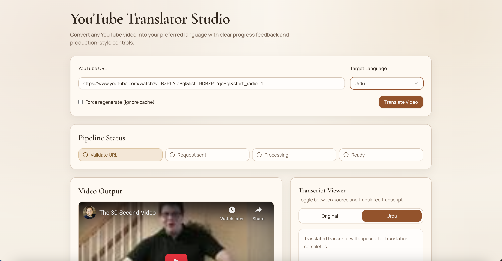
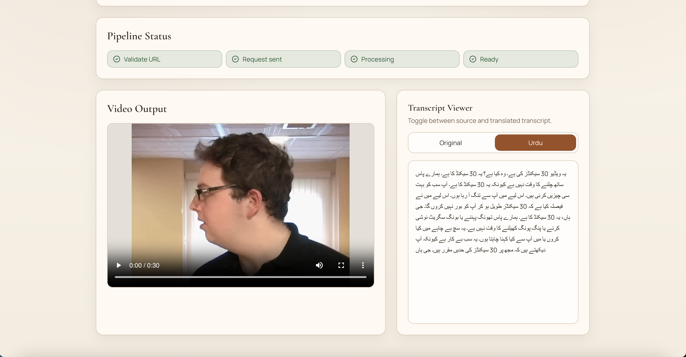

# Real Time Translator (YouTube)

This project translates a YouTube video into a target language and returns a translated output video.

It currently includes:

- `react-youtube-translator-main`: Next.js frontend UI
- `youtube-translator-server-main`: Flask backend + media processing pipeline

## UI Preview

### Before



### After



The backend flow is:

1. Download YouTube video (`yt-dlp`)
2. Extract audio (`ffmpeg`)
3. Transcribe speech (OpenAI Whisper API)
4. Translate text
5. Generate translated speech (`gTTS`)
6. Merge translated audio with video (`ffmpeg`)

## Prerequisites

- Node.js 20+
- Python 3.10+
- `ffmpeg` installed and available in PATH
- OpenAI API key with available quota/credits

Install ffmpeg on macOS:

```bash
brew install ffmpeg
```

Verify:

```bash
which ffmpeg
ffmpeg -version
```

## Required Configuration

Create backend env file:

`youtube-translator-server-main/.env`

```env
OPENAI_API_KEY=your_openai_api_key
VIDEO_CACHE_TTL_HOURS=24
VIDEO_CACHE_MAX_FILES=200
```

Notes:

- `OPENAI_API_KEY` is required for transcription in current pipeline.

## Run Locally

### 1) Start backend

```bash
cd youtube-translator-server-main
python3 -m venv .venv
source .venv/bin/activate
pip install -r requirements.txt
python server.py
```

Backend default URL:

`http://127.0.0.1:8000`

### 2) Start frontend

```bash
cd react-youtube-translator-main
npm install
npm run dev
```

Frontend default URL:

`http://localhost:3000`

### 3) Optional frontend API override

If needed, set:

`react-youtube-translator-main/.env.local`

```env
NEXT_PUBLIC_API_BASE_URL=http://127.0.0.1:8000
```

## Current API Contract

`POST /translate`

Request:

```json
{
  "video_id": "ZU6igLYRf50",
  "target_language": "ur",
  "force_regenerate": false
}
```

Response:

```json
{
  "output": "http://127.0.0.1:8000/media/<file>.mp4",
  "local_file": "/abs/path/to/file.mp4",
  "cache_hit": true,
  "regenerated": false,
  "original_transcript": "...",
  "translated_transcript": "..."
}
```

## Common Issues

- `Failed to fetch`: backend not running or wrong API URL/port.
- `Translation failed` with quota error: add OpenAI credits or verify correct API key.
- Long processing/stuck look: first run can be slow; use force regenerate only when needed.
- Corrupt old outputs: remove stale files under `youtube-translator-server-main/videos/`.

## Security Notes

- Do not commit `.env` files.
- Do not commit generated media under `youtube-translator-server-main/videos/`.
- Do not commit service-account JSON or API secrets.
